# Hahaliu Workflow

`hahaliu-workflow` 是面向 Claude Code 与 Codex 的工程工作流裁决层。它不替代宿主的编码能力，也不是第五套开发框架；它负责判断任务形状、选择唯一执行主链、附加必要门禁，并要求用本次真实证据完成交付。

> A workflow control layer for Claude Code and Codex: one execution mainline, explicit authorization boundaries, task-scoped changes, and fresh verification evidence.

## 它解决什么问题

Agent 的问题通常不是“不会写代码”，而是缺少稳定的执行纪律：

- 一个任务同时触发多套澄清、计划和实现流程，互相重复甚至冲突。
- 用户已有未提交改动，却用整个 working tree 或 `HEAD` 猜哪些变化属于本次任务。
- 测试曾经通过、validator 显示 PASS，便被误当成当前功能已经可用。
- “修复”“完成”“发版”被错误解释成允许 commit、push、部署或写外部系统。
- 小改动被套上过重流程，高风险契约变更却因为代码行数少而跳过门禁。

`hahaliu-workflow` 把这些问题收敛成一套控制面：

1. 先服从用户、宿主和项目规则。
2. 判断是否已有项目级 auto-skill 接管。
3. 按任务形状选择 `fast`、`focused`、`full` 或 `review`。
4. 整个任务只保留一条负责完成判定的主链。
5. 有修改时，用 Task Delta 隔离本次变化。
6. 用与风险匹配的当次验证证明结果。
7. Git、发布和外部副作用只执行本次明确授权的具体动作。

## 工作流总览



图的可编辑与复用版本：

- [Mermaid 源文件](diagrams/hahaliu-workflow-overview.mmd)
- [Excalidraw 可编辑文件](diagrams/hahaliu-workflow-overview.excalidraw)
- [PNG 图片](diagrams/hahaliu-workflow-overview.png)

## 裁决优先级

本 skill 不会覆盖更高优先级的约束。实际优先级是：

1. 用户当前请求中的明确指令与授权。
2. System、developer、`AGENTS.md`、`CLAUDE.md` 等宿主或项目规则。
3. 当前项目的 `<project>-auto-skill`。
4. `hahaliu-workflow` 的公共裁决与安全底线。
5. 被选中的 leaf skill 自身默认流程。

如果项目 auto-skill 明确覆盖当前任务，它负责业务路由；`hahaliu-workflow` 只保留用户指令优先、唯一主链、授权边界、任务归属和新鲜证据底线。

## 四条执行路径

路径表达的是任务形状与风险，不是模型质量或“认真程度”。

| 路径 | 适用情况 | 最小执行骨架 | 典型证据 |
|---|---|---|---|
| `fast` | 落点和语义明确的文档、文案或机械配置小改；不改变公共行为契约 | 定位 → 修改前快照 → 最小修改 → 定向验证 | 链接检查、格式检查、目标脚本或最小构建 |
| `focused` | 根因或需求已明确的单链 bug、小功能、局部行为改动 | 最窄复现 → RED → GREEN → 单轴评审 → 受影响区域回归 | 修复前失败证据、修复后测试、目标 delta 评审 |
| `full` | 新能力、模糊需求、公共契约、跨层修改或高风险边界 | 澄清 → 目标契约 → 计划/规格 → 垂直切片 → 多轴评审 → 验收重放 | 契约测试、定向测试、类型检查/构建、真实行为证据 |
| `review` | 用户只要求审计、诊断、评估或 QA，不授权修改 | 只读取证 → 分轴 findings → 标明未验证范围 → 声明未修改 | 文件与调用链证据、复现结果、运行时或页面观察 |

以下情况至少升级到 `full`：

- 新增或修改 schema、wire format、持久化格式。
- 触及认证、权限、密钥、数据出域或路径沙箱。
- 同时修改两个以上相互独立的区域。
- 需要决定产品语义、兼容策略或不可逆迁移。

## 一次任务如何运行

### 1. 读取真实约束

先读取当前用户指令、宿主规则、仓库规则和项目 auto-skill。能从代码、文档或运行环境查到的事实先自行核对，只把会实质改变产品结果的决策交给用户。

### 2. 定档并声明执行方式

开工时用一行说明本次路径、主链、门禁和关键验证：

```text
路径: focused | 主链: 最窄复现→TDD 修复 | 门禁: Task Delta、单轴 review | 验证: 目标测试+受影响区域回归
```

对于 `focused` 和 `full`，实施前建立简短目标契约：

- Outcome：最终要产生什么用户可见结果。
- Scope：本次包含和不包含什么。
- Constraints：权限、兼容性、环境和不可触碰边界。
- Subtasks：可验证的最小切片。
- Risks：最可能导致返工或误判的地方。
- Acceptance：什么证据才算完成。

### 3. 只选一条主链

三个概念必须分开：

| 概念 | 职责 | 是否能决定完成 |
|---|---|---|
| 主链 | 负责澄清、计划、实现编排和完成判定 | 是，同一任务只能有一条 |
| 门禁 | 在固定节点执行复现、TDD、权限确认或完成前验证 | 否，只能附着在主链上 |
| 评审镜头 | 从 Standards、Spec 或安全角度独立检查同一个 delta | 否，结论作为主链的输入 |

因此 gstack、Superpowers、Matt Pocock Skills、Codex 原生计划和子智能体不会同时成为多条平行主链。可用且匹配时选择其中一条；其他能力只能作为 leaf skill、门禁或评审镜头。

### 4. 用 Task Delta 隔离本次改动

工作树可能在任务开始前已经很脏。`git diff HEAD` 只能显示“相对某个提交有什么变化”，不能证明“哪些变化由当前任务产生”。

Task Delta 的处理方式是：

1. 在首次编辑前记录工作树状态。
2. 对每个将修改的文件保存任务开始时的私有基线。
3. 新文件记录为 `ABSENT`，但只有当它在本任务开始时确实不存在。
4. 收尾时使用 `git diff --no-index` 比较基线与现状。
5. 评审和最终报告只引用这个任务专属 patch。
6. 敏感文件、设备、FIFO、symlink、超大文件等危险输入会被拒绝或只记录安全元数据。

两套适配器都内置了 `scripts/task-delta.sh`，快照写入仓库外的私有临时目录，不要求 commit，也不会用 `HEAD` 猜任务归属。

### 5. 按路径执行最小实现

- `fast`：只做能追溯到请求的局部修改，不引入额外抽象。
- `focused`：先让最窄复现或回归检查失败，再实现最小修复并转绿。
- `full`：先冻结共享契约，再按可独立验证的垂直切片推进。
- `review`：保持只读，findings 按严重度、证据和影响排序，不把偏好写成 bug。

小任务留在主上下文顺序完成。只有问题域独立、文件所有权可切分，或者评审确实需要上下文隔离时，才派子智能体；主上下文负责验真与最终裁决。

### 6. 运行当次验证

验证必须与本次风险匹配，并说明每一层证据究竟证明了什么：

| 证据 | 能证明什么 | 不能证明什么 |
|---|---|---|
| 结构 validator | manifest、frontmatter、链接或确定性规则满足要求 | 模型在真实任务中一定正确路由 |
| 单元/定向测试 | 被覆盖逻辑满足断言 | 未覆盖路径和真实集成一定可用 |
| 类型检查/构建 | 当前代码能通过对应工具链 | 用户实际交互一定正确 |
| 浏览器或运行时 smoke | 被观察路径在当前环境真实工作 | 全部环境、权限和边界都已覆盖 |
| fresh-context 冷测 | 新上下文能按预期发现和执行 skill | 长期稳定或所有模型版本都正确 |

验证失败必须分类：

- **本任务引入**：继续修复，或明确标记 `BLOCKED`；不能声称完成。
- **原有失败**：保存 baseline 证据并报告，不顺手扩大任务范围。
- **环境阻塞**：说明缺少什么环境、哪些路径未验证以及如何复现。

### 7. 单独处理 Git、发布和外部副作用

允许修改文件不等于允许 Git 写入或发布。以下动作必须获得用户针对当前请求的明确授权：

- `git add`、commit、stash、switch、merge、rebase、reset、clean、fetch、pull、push。
- 创建或更新 PR、发布、部署。
- 写外部 tracker、发送邮件或通知。
- 修改生产数据或触发真实业务副作用。

即使某个被调用的 skill 把 commit、push 或发布当作默认完成协议，也不能借此扩大授权。未授权时，工作流交付未提交的任务 delta、验证证据和风险说明后停止。

### 8. 用固定结构收尾

最终报告至少说明：

1. 用户可见结果。
2. 本次修改文件与任务专属 delta。
3. 实际运行的验证命令及结果。
4. 未验证范围、已知风险和阻塞项。
5. Git、PR、发布或外部状态究竟发生了什么。

有修改但未提交时必须明确说“未提交”；只读任务必须明确说“本次未修改文件”。

## 常见任务示例

### 已知根因的 bug

```text
请求：修复会话过期后页面白屏，原因已定位为空 session 未处理。
路径：focused
主链：最窄复现 → 回归测试 RED → 最小空值处理 → GREEN
评审：Standards/correctness 单轴
完成证据：目标测试、受影响登录流程回归、任务专属 delta
```

### 跨层协议变更

```text
请求：为事件协议增加字段，并兼容旧客户端。
路径：full
主链：冻结 wire contract 与兼容语义 → 服务端/客户端垂直切片 → 双轴评审
门禁：schema、序列化、兼容性、迁移/回滚检查
完成证据：契约测试、两端构建、旧版本兼容重放
```

### 只读安全审计

```text
请求：只审计权限判断，不要修改。
路径：review
主链：读取真实入口和调用链 → 构造边界用例 → 按严重度输出 findings
限制：不编辑、不自动修复、不执行 Git 写命令
完成证据：代码位置、运行结果、未验证范围、本次未修改文件声明
```

## 可选集成与无插件模式

核心授权、路由、Task Delta 和验证纪律是自包含的。gstack、Superpowers、Matt Pocock Skills（MP）、ECC reviewers 和 Codex CLI 都是可选增强，不是安装本 skill 的硬依赖。

| 集成 | 主要适配器 | 安装后提供的增强 | 未安装时的行为 |
|---|---|---|---|
| Superpowers | 两端，按宿主实际可用能力 | systematic debugging、TDD、brainstorming、writing plans、完成前验证 | 使用宿主原生能力执行复现、根因定位、RED/GREEN、计划和验证 |
| Matt Pocock Skills | Claude Code | grilling、`to-spec`、`to-tickets`、research、domain modeling、prototype | 使用目标契约、原生 plan 和垂直切片完成较轻量的等价流程 |
| gstack | 两端，按宿主实际可用能力 | office-hours、context save/restore、retro、QA/review/autoplan 方法 | 在当前对话中完成需求判断、检查清单、总结和复盘，不假装调用缺失 skill |
| ECC reviewers | Claude Code | 额外验证或评审能力 | 使用主上下文或 fresh-context 子智能体完成必要评审 |
| Codex CLI | Claude Code | 只读第二意见、架构挑战或救援通道 | 跳过该镜头并如实报告，不伪造跨模型意见 |

缺少可选集成时，validator 应报告 WARN 或跳过相关漂移检查，而不是把它们误判为核心 skill 不可用。真实行为仍应通过无插件 fresh-context 冷测验证。

## 两套独立适配器

本仓库同时发布 Claude Code 与 Codex 版本。它们共享方法论，但不能混装或互相 symlink。

| Host | Package | 平台适配 |
|---|---|---|
| Claude Code | `claude-code/hahaliu-workflow/` | Claude Code skill/plugin discovery、可选插件探测、声明/轨迹/编排评测、Codex 只读咨询包装器 |
| Codex | `codex/hahaliu-workflow/` | System/developer、`AGENTS.md`、项目 auto-skill、Codex 原生 plan/goal、子智能体和紧凑确定性 validator |

Codex 适配器不依赖 `.claude/rules`、`AskUserQuestion`、`ExitPlanMode`、Claude 插件缓存路径或 Claude 专属浏览器协议。Claude Code 适配器也不会被直接符号链接成 Codex skill。

更多说明见 [平台差异](docs/platform-differences.md) 与 [共享原则](docs/shared-principles.md)。

## 安装

Canonical repository: `hahaliu1029/hahaliu-workflow`。

### Claude Code marketplace

```text
/plugin marketplace add hahaliu1029/hahaliu-workflow
/plugin install hahaliu-workflow@hahaliu-workflow
```

### Codex marketplace

```bash
codex plugin marketplace add hahaliu1029/hahaliu-workflow
```

然后从 Codex Plugins Directory 安装 `hahaliu-workflow`。

也可以手动复制与宿主匹配的 `hahaliu-workflow` 目录。不要把两个适配器复制进同一个目标目录，也不要在未检查差异时覆盖本地定制版本。

完整步骤见 [安装说明](docs/installation.md)。

## 仓库结构

```text
.
├── claude-code/hahaliu-workflow/   # Claude Code 适配器
├── codex/hahaliu-workflow/         # Codex 适配器
├── diagrams/                       # README 流程图源文件与渲染产物
├── docs/                           # 安装、共享原则、平台差异、验证等级
├── scripts/validate-release.sh     # 仓库级发布校验
├── .claude-plugin/                 # Claude plugin / marketplace manifest
├── .codex-plugin/                  # Codex plugin manifest
└── .agents/plugins/                # Codex marketplace manifest
```

## 验证

在仓库根目录运行：

```bash
scripts/validate-release.sh
```

发布校验覆盖仓库卫生、JSON manifests、Shell 语法、Python 语法，以及两套适配器自带的 validator 与 selftest。

验证等级必须分开报告：

1. Structure passed：结构、manifest、frontmatter 和确定性规则通过。
2. Scripts passed：Task Delta、Git 命令分类和脚本 selftest 通过。
3. Behavior conditionally passed：隔离的 fresh-context route cases 通过。
4. Real task passed：在真实项目任务上获得本次测试、构建或浏览器证据。
5. Safe and stable to distribute：重复冷测、项目优先级、授权和回归边界均无已知高风险假绿。

低等级证据不能冒充更高等级保证。详情见 [验证等级](docs/validation-levels.md)。

## 安全默认值

- 未经当前请求的明确授权，不执行 Git 写入、发布、部署或外部副作用。
- 保留用户已有脏工作树，不隐式 stash、reset、clean 或覆盖无关改动。
- Task Delta 在首次编辑前建立任务专属基线。
- 不把静态 validator、旧测试数字、TODO 状态或子智能体自报当作完成证据。
- 需要真实页面验收时，遵守当前项目的浏览器与登录态规则，不用模拟结果替代真实证据。

## License

MIT。作为可选集成提及的第三方项目仍使用各自许可证，本仓库不捆绑它们。
